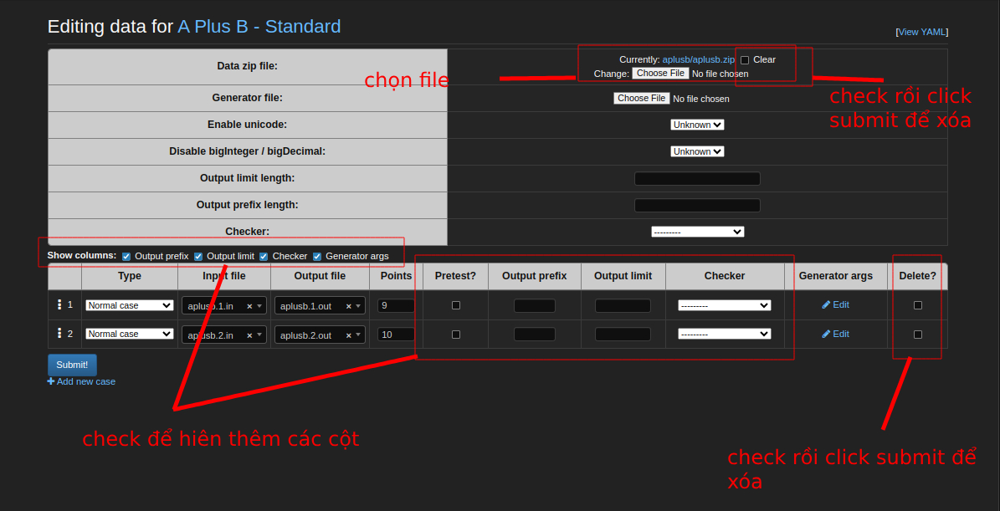
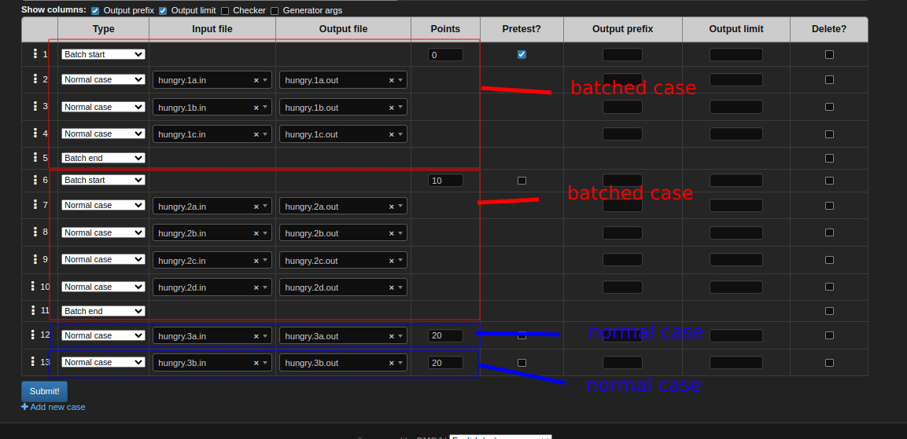
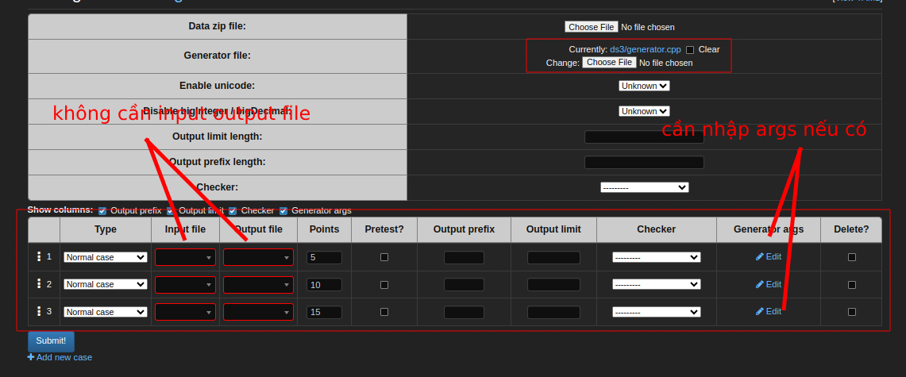
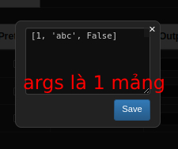

# Tạo đề bài (admin > problems > add)

Các mục thêm vào funix là:

1. PROBLEM INITIAL SOURCES: không bắt buộc. Là code mẫu, có các `[...]` để học viên điền code vào.
2. PROBLEM TEST CASES: với các đề bài HTML, ở dưới cùng có thêm mục này (sau khi tạo đề bài > tạo test data và click `Update problem data (beta)`). Đây là các criteria của HTML problem. Click vào từng criteria để đi tới trang thêm ngôn ngữ (tiếng Anh, tiếng Việt). Thứ tự tạo đề bài HTML là: tạo đề bài > tạo test data > click `Update test data (beta)` > vào lại trang admin chỉnh sửa đề bài để thêm, sửa ngôn ngữ criteria.

---

# Tạo test data

Có 2 cách:

- Bằng site interface
- Bằng tay

## Tạo bằng site interface

https://docs.dmoj.ca/#/site/managing_problems?id=editing-test-data

Ý nghĩa các fields:

- Output limit length: độ dài stdout. Nếu thí in ra stdout lớn quá giới hạn này sẽ bị lỗi OLE (Output Limit Exceeded) hoặc khoảng 256mb nếu không được specified. Ví dụ: output_limit_length = 3, thí sinh print(12) thì ok, print(123) thì lỗi OLE (3 ký tự trở lên).

- Output prefix length: độ dài ouput của thí sinh sẽ được hiển thị. output_prefix_length = 3, thí sinh print(12345) thì khi submit xong, ouput của thí sinh sẽ hiện là '123'. (chỉ là về mặt hiển thị, không ảnh hưởng kết quả thí sinh).

2 trường trên giúp hạn chế những trường hợp ouput tốn bộ nhớ. VD:

```python
while True:
    print('aaaaaaaa')
```

### Tạo standard test data


Sau khi nhấn submit, site sẽ:

- Tạo folder có tên là code của problem trong DMOJ_PROBLEM_DATA_ROOT
- Upload file zip vào trong folder này
- Tạo file init.yml theo những gì ta đã nhập.

Sau khi tạo xong, judge sẽ cập nhật data này để chấm điểm.
Phần site sẽ có thông tin các test cases của problem để hiển thị trước cho thí sinh.

### Tạo batched test data



### Tạo generators test data



Generator arguments là mảng chứa các tham số sẽ được convert thành Python str.

## Tạo bằng tay

- Tạo bằng tay nghĩa là:

  - Tự tạo folder có tên là code của problem muốn tạo.
  - Tự copy file zip nếu có vào
  - Tự viết file init.yml

- Trường hợp dùng custom judge cần tạo bằng tay, vì site interface không có mục nào để nhập custom judge cả.
- Judge có watchdog dùng để theo dõi sự thay đổi trong DMOJ_PROBLEM_DATA_ROOT, nên khi có thay đổi, judge sẽ cập nhật.
- Tạo bằng tay thì site sẽ không nhận biết được điều này do site không có cơ chế trên.
- Do đó tạo bằng tay sẽ không hiển thị trước được có bao nhiêu test cases, input và expected ouput data là gì ở trang làm bài. Nhưng vẫn submit và chấm điểm bình thường.
- Khi tạo bằng tay xong, click vào nút "Update test data (beta)" để site sẽ lưu data vào, như vậy sẽ có data hiển thị trước.

Ví dụ:

```yml
custom_judge: seed2.py
unbuffered: true
archive: seed2.zip
pretest_test_cases:
  - { in: seed2.1.in, points: 20 }
  - { in: seed2.2.in, points: 20 }
  - { in: seed2.3.in, points: 20 }
  - { in: seed2.4.in, points: 20 }
  - { in: seed2.5.in, points: 20 }
```

- Tạo folder có tên là code của problem (ví dụ là seed2).
- Tạo file init.yml có nội dung như trên vào folder.
- Tạo file `seed2.1.in`, `seed2.2.in`, `seed2.3.in`, `seed2.4.in`, `seed2.5.in` chứa data input, nén lại trong file `seed2.zip`. Copy file zip này vào thư mục trên.
- Vào giao diện web, đi đến trang `/problem/seed2`, click `Update test data (beta)`.
- Vào trang làm bài `/beta/problem/seed2` kiểm tra xem đã có data hiển thị trước chưa và có thế chấm được chưa. Nếu chưa, restart máy chấm.

## Tạo bài tập HTML

Làm theo thứ tự sau:

1. Tạo đề bài.
2. Tạo test data bằng tay.
3. Vào bài tập vừa làm tại `/problem/<problem code>`, click `Update test data (beta)`. Bước này giúp site interface cập nhật criteria vào đề bài từ các criteria trong file test.
4. Vào trang sửa đề bài, cuộn xuống cuối cùng sẽ thấy **PROBLEM TEST CASES**, click vào từng criteria để thêm các bản dịch.
